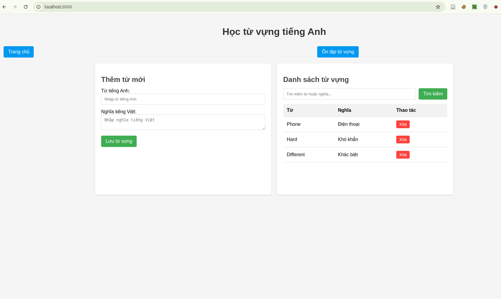

# Redis với FastAPI: Học từ vựng tiếng Anh

Redis là một hệ thống lưu trữ key-value in-memory rất phù hợp cho ứng dụng từ vựng tiếng Anh vì khả năng truy xuất nhanh và dễ dàng lưu trữ dữ liệu.

Tạo một ứng dụng đơn giản với FastAPI và Redis để học từ vựng tiếng Anh, bao gồm:
1. Cài đặt môi trường
2. Tích hợp Redis với FastAPI
3. Xây dựng giao diện đơn giản

## 1. Cài đặt Redis và các thư viện cần thiết

```bash
# Cài đặt Redis (Linux/Mac)
# Ubuntu/Debian
sudo apt-get install redis-server

# macOS với Homebrew
brew install redis

# Cài đặt các thư viện Python
pip install fastapi uvicorn redis jinja2
```

Nếu sử dụng Windows,  tải Redis từ https://github.com/tporadowski/redis/releases hoặc sử dụng Docker.

## 2. Hướng dẫn chạy ứng dụng


1. **Khởi động Redis Server**:
   ```bash
   # Ubuntu/Debian
   sudo service redis-server start

   # macOS
   brew services start redis

   # Windows (nếu cài đặt trực tiếp)
   redis-server
   ```

2. **Chạy ứng dụng FastAPI**:
   ```bash
   python main.py
   ```

3. **Truy cập ứng dụng**:
   Mở trình duyệt và truy cập địa chỉ: http://localhost:8000

## 3. Giải thích code

### FastAPI và Redis

1. **Kết nối Redis**:
   ```python
   r = redis.Redis(host='localhost', port=6379, db=0, decode_responses=True)
   ```
   - `host` và `port`: Địa chỉ của Redis server
   - `decode_responses=True`: Tự động chuyển đổi bytes thành chuỗi khi đọc dữ liệu

2. **Lưu trữ từ vựng trong Redis**:
   - Sử dụng cấu trúc Hash để lưu trữ từ vựng
   - Key: "vocabulary"
   - Fields: Các từ tiếng Anh
   - Values: Nghĩa tiếng Việt

3. **API endpoints**:
   - `GET /`: Hiển thị trang chủ với danh sách từ vựng
   - `POST /add`: Thêm từ mới vào Redis
   - `GET /api/words`: API để lấy danh sách từ vựng (sử dụng cho JavaScript)

### Giao diện

- Giao diện chia làm hai phần: nhập từ mới bên trái và hiển thị danh sách từ vựng bên phải
- Sử dụng JavaScript để tải lại danh sách từ vựng khi trang được load
- Sử dụng Jinja2 để render template


## 4. Một số lưu ý khi sử dụng Redis

1. **Cách Redis lưu trữ dữ liệu**:
   - Redis lưu trữ dữ liệu trên RAM, nên tốc độ truy xuất rất nhanh
   - Mặc định, Redis sẽ lưu dữ liệu xuống đĩa cứng sau mỗi khoảng thời gian
   - Trong ứng dụng học từ vựng này, dữ liệu được lưu trữ vĩnh viễn và không mất khi khởi động lại ứng dụng

2. **Cấu trúc dữ liệu Redis thích hợp**:
   - Redis hỗ trợ nhiều cấu trúc dữ liệu: String, List, Set, Hash, Sorted Set
   - Trong ví dụ này, chúng ta sử dụng Hash để lưu từ vựng và nghĩa
   - Bạn có thể mở rộng ứng dụng bằng cách sử dụng Sorted Set để lưu lịch sử xem từ vựng

3. **Tối ưu hóa hiệu suất**:
   - Redis có thể xử lý hàng ngàn yêu cầu mỗi giây
   - Với ứng dụng từ vựng nhỏ, bạn không cần lo lắng về hiệu suất
   - Nếu ứng dụng phát triển lớn, bạn có thể cân nhắc sử dụng Redis Pipeline hoặc Redis Cluster

4. **Bảo mật**:
   - Trong môi trường phát triển, Redis thường không yêu cầu mật khẩu
   - Với môi trường sản xuất, bạn nên cấu hình mật khẩu và các tùy chọn bảo mật khác

## 5. Mở rộng ứng dụng

Dưới đây là một số ý tưởng bạn có thể thực hiện để mở rộng ứng dụng:

1. **Thêm chức năng xóa từ vựng**
2. **Thêm chức năng tìm kiếm từ vựng**
3. **Thêm chức năng ôn tập từ vựng**: Hiển thị ngẫu nhiên từ và yêu cầu người dùng nhớ nghĩa
4. **Thêm chức năng phân loại từ vựng theo chủ đề**
5. **Thêm chức năng xác thực người dùng**: Mỗi người dùng có thể có bộ từ vựng riêng

Bạn có muốn tìm hiểu thêm về bất kỳ phần nào hoặc cần hỗ trợ thêm cho ứng dụng này không?
